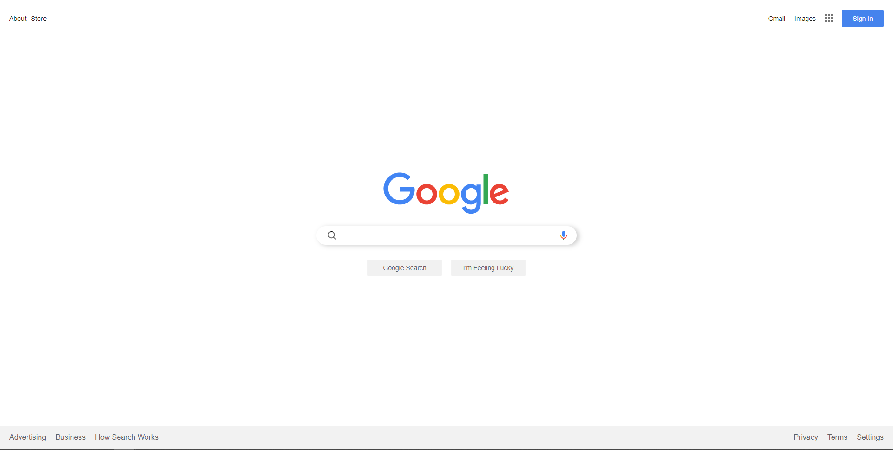

# Google Clone

Bu repo [Patika.Dev](https://www.patika.dev) Front-End Eğitiminde ödev olarak yapmış olduğum Google Clone arayüzü. 



## Installation

Öncelikle projeyi clonelayın. [Google Clone](https://github.com/dgnarslan/googleClone.git)

```bash
git clone https://github.com/dgnarslan/googleClone.git
```

## Usage

Projeyi cloneladıktan sonra Visual Studio Code programında açınız.

Linux için:

```linux
cd kodluyoruzilkrepo
code .
```

## Contributing

Pull requestler kabul edilir. Büyük değişiklikler için, lütfen önce neyi değiştirmek istediğinizi tartışmak için bir konu açınız.

## License

[MIT](https://choosealicense.com/licenses/mit/)
